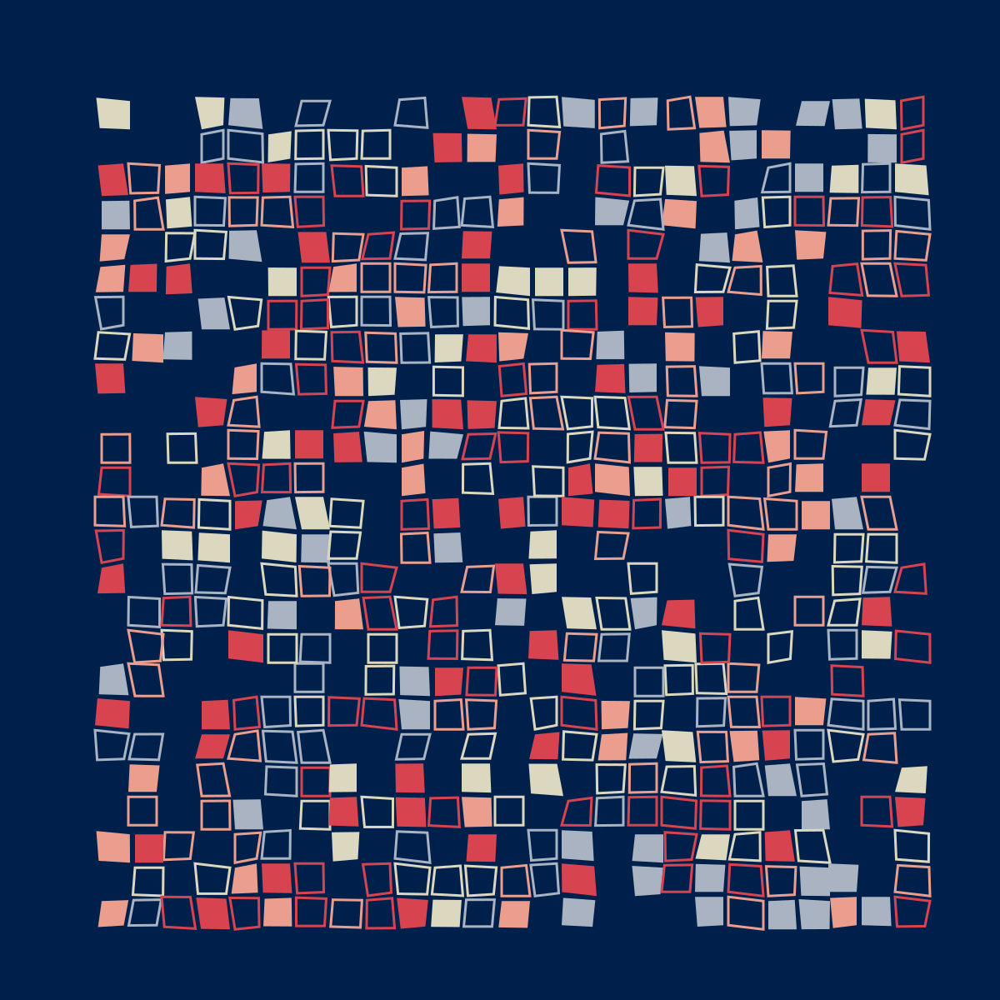

# Generative Art: Blue

The code here is essentially that discussed in [this post by Benjamin Kovach](https://www.kovach.me/posts/2018-03-07-generating-art.html).  Kovach's code is [here](https://github.com/jxxcarlson/genart-kovach).

The only changes are in some internal parameters: color scheme and size of the 
squares.  

